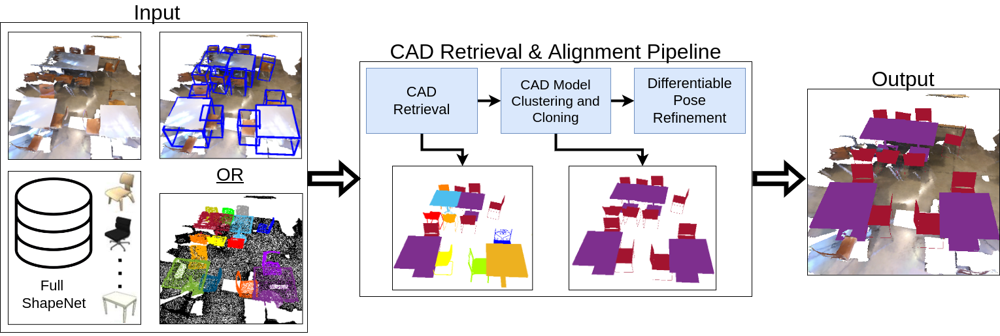

# Automatically Annotating Indoor Images with CAD Models via RGB-D Scans

<p align="center">

<br>
<a href="https://arxiv.org/abs/2212.11796">arXiv</a>
</p>

This repository contains the code and data for the WACV23 paper "Automatically Annotating Indoor Images with CAD Models via RGB-D Scans". 

 
## Installation Requirements and Setup
* Clone this repository. Create and activate the virtual environment.

**Note:** We tested the code using PyTorch v1.7.1, PyTorch3D v0.6.2 and Cuda 10.1. The following
installation guide is customized to these specific versions. You may have to 
install different versions according to your system specifications. For general information about
how to install PyTorch3D see the 
[official installation guide](https://github.com/facebookresearch/pytorch3d/blob/main/INSTALL.md).

The runtime dependencies can be installed by running:

```bash
conda create -n scannotate python=3.9
conda activate scannotate
conda install pytorch==1.7.1 torchvision==0.8.2 torchaudio==0.7.2 cudatoolkit=10.1 -c pytorch -c nvidia -c conda-forge
conda install -c fvcore -c iopath -c conda-forge fvcore iopath
```
For the CUB build time dependency, which you only need if you have CUDA older 
than 11.7, run:
```bash
conda install -c bottler nvidiacub
```
After installing the above dependencies, run the following commands:
```bash
pip install scikit-image matplotlib imageio plotly opencv-python open3d trimesh==3.10.2
conda install pytorch3d==0.6.2 -c pytorch3d
```

The corresponding environment file can be found at `environment.yml`.

## Data Preprocessing

* Download the ScanNet example [here](https://files.icg.tugraz.at/f/bf3309cbb870443b93c9/?dl=1). Extract
the folders `extracted, preprocessed, scans` and copy them to `/data/ScanNet`. Note that by downloading the 
example you agree to the 
[ScanNet Terms of Use](https://kaldir.vc.in.tum.de/scannet/ScanNet_TOS.pdf).

    This data example additionally contains the already preprocessed input scan, e.g. 3D bounding box and
instance segmentation for the target objects as well as the 3D scan transformed into the PyTorch3D 
coordinate system.


* Download the [ShapenetV2](https://shapenet.org/) dataset by signing up
on the website. Extract ShapeNetCore.v2.zip to `/data/ShapeNet`.

#### Preprocessing ShapeNet CAD Models
To center and scale-normalize the downloaded ShapeNet CAD models, run:
```bash
bash run_shapenet_prepro.sh gpu=0
```
The `gpu` argument specifies which GPU should be used for processing. 
By default, code is executed on CPU.

After the above-mentioned steps the `/data` folder should contain the following directories:
```text
- data
    - ScanNet
        - extracted
        - preprocessed
        - scans
    - ShapeNet
        - ShapeNet_preprocessed            
        - ShapeNetCore.v2
```

## Run CAD Model Retrieval

Our pipeline for automatic CAD model retrieval consists of three steps. Results after each step will be saved 
to `/results`.

**Note** that we use PyTorch3D as rendering pipeline, hence all 3D data are transformed
into the PyTorch3D coordinate system. Information about this coordinate system can be found 
[here](https://github.com/facebookresearch/pytorch3d/blob/main/docs/notes/assets/world_camera_image.jpg).

The configuration file is a simple text file in `.ini` format. 
Default values for configuration parameters are available in `/config`. 
Note that these are just an indication of what a "reasonable" value for each parameter could be, 
and are not meant as a way to reproduce any of the results from our paper.

#### 1) CAD Model Retrieval
Run CAD model retrieval with: 
```bash
bash run_cad_retrieval.sh config=ScanNet.ini gpu=0
```
The results will be written to `/results/ScanNet/$scene_name/retrieval`. Results contain the top5 retrieved
CAD models for each target object, as well as the combined top1 results for all target objects. 
Additionally, the scene mesh without target
objects is written to `/results/ScanNet/$scene_name`, which might be beneficial for visualization.

#### 2) CAD Model Clustering and Cloning
Run CAD model clustering and cloning with: 

```bash
bash run_cad_similarity.sh config=ScanNet.ini gpu=0
```
Results after CAD model clustering and cloning will be written to `/results/ScanNet/$scene_name/similarity`.
#### 3) Pose Refinement
Run 9DOF differentiable pose refinement with:
```bash
bash run_cad_pose_refine.sh config=ScanNet.ini gpu=0
```
Final results after 9DOF pose refinement will be written to `/results/ScanNet/$scene_name/refinement`.


## Citation
If you found this work useful for your publication, please consider citing us:

```
@inproceedings{ainetter2023automatically,
  title={Automatically Annotating Indoor Images with CAD Models via RGB-D Scans},
  author={Ainetter, Stefan and Stekovic, Sinisa and Fraundorfer, Friedrich and Lepetit, Vincent},
  booktitle={Proceedings of the IEEE/CVF Winter Conference on Applications of Computer Vision},
  pages={3156--3164},
  year={2023}
}
```